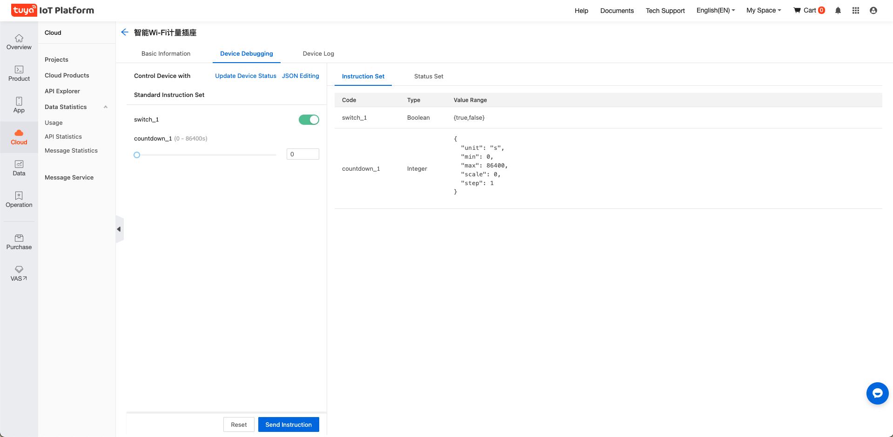

# edgex-device-tuya-go

[English](./README.md) | [中文版](./README_zh.md)

## Overview
This topic describes Tuya's microservice, the device service for connecting `Powered by Tuya` devices to EdgeX.

## Procedure

### Step 1: Preparation

Create a project on Tuya's [Cloud Development Platform](https://iot.tuya.com/cloud/) and associate at least one device with the project.

### Step 2: Run EdgeX

1. Download the latest version of EdgeX.

```
git clone https://github.com/edgexfoundry/edgex-compose.git
```

2. Open the `edgex-compose` directory that has just been cloned locally.

    - run EdgeX in `no-sec` mode.

   ```
   make pull no-secty
   make run no-secty
   ```

    - run EdgeX in `sec` mode.

   ```
   make pull
   make run
   make get-token
   ```
:::info
You can run the `make down` command to stop all containers.
:::

For more information about docker-compose startup, visit https://github.com/edgexfoundry/edgex-compose/blob/master/README.md.

For more information about token generation in `sec` mode, visit https://github.com/edgexfoundry/edgex-go/blob/master/SECURITY.md.

### Step 3: Run device-tuya-go

1. Make sure that EdgeX is running as expected.

2. Set environment variables.

   Set the following option to **true** in **sec** mode.

   ```
   EDGEX_SECURITY_SECRET_STORE=false
   ```

3. Get the latest driver code from GitHub.

   ```
   git clone https://github.com/Tuya-Community/edgex-device-tuya-go.git
   ```

4. Modify the configuration file before you run the driver.

   The following configurations are required:

    - Set `Service.Host` to the **exact IP address** of the host running the driver, **rather than** the localhost such as `127.0.0.1, 0.0.0.0`.

    - Modify all data under `[TuyaConnectorInfo]`. The data is the project information created on the Cloud Development Platform in Step 1. The following table shows the settings of `Region`:

      | Region        | Value |
           | ------------- | ----- |
      | China         | CN    |
      | United States | US    |
      | European      | EU    |
      | India         | IN    |

    - If you run EdgeX in **sec** mode, modify the file address of `TokenFile` in `[SecretStore]`.

5. Run the driver.

   Go to the `cmd` directory of the project and run the following code:

   ```
   go run main.go --cp=consul.http://localhost:8500 --registry
   ```

   You can also start the driver on Docker:

    - Get the docker image.

      Enter the project root directory:

      ```
      make docker_device_tuya_go
      ```

    - Run the driver on Docker.
      :::important
      The directory to be mounted is set to the directory in your project. In `sec` mode, apply this setting: `EDGEX_SECURITY_SECRET_STORE="true"`.
      :::
      ```
      docker run --name edgex-device-tuya \
        --network=edgex_edgex-network \
        -v /your/local/path/device-tuya-go/cmd/res:/res \
        -e CLIENTS_CORE_COMMAND_HOST="edgex-core-command" \
        -e CLIENTS_CORE_DATA_HOST="edgex-core-data" \
        -e CLIENTS_CORE_METADATA_HOST="edgex-core-metadata" \
        -e CLIENTS_SUPPORT_NOTIFICATIONS_HOST="edgex-support-notifications" \
        -e CLIENTS_SUPPORT_SCHEDULER_HOST="edgex-support-scheduler" \
        -e DATABASES_PRIMARY_HOST="edgex-redis" \
        -e EDGEX_SECURITY_SECRET_STORE="false" \
        -e MESSAGEQUEUE_HOST="edgex-redis" \
        -e REGISTRY_HOST="edgex-core-consul" \
        -e SERVICE_HOST="edgex-device-tuya" \
        -d edgexfoundry/device-tuya:0.0.0-dev
      ```

1. View the device service name.

   After the driver is running as expected, the device service is automatically registered to `core-metadata` of EdgeX and the service name is `device-tuya`. To view the service name, run the following command:

   ```
   curl http://localhost:59881/api/v2/deviceservice/name/device-tuya
   ```

### Step 4: Add devices

Add the devices that have been added to the IoT project in Step 1 to `core-metadata` of EdgeX. Perform the following steps:

1. Add the device profile.

   A sample file is prepared in the `cmd/res/` directory of the project. The sample file is a socket. You can modify it as the configuration file of the device to be added. The following code block shows the sample file:

   ```yaml
   name: "Test.Device.TUYA.Profile"	# This name must be unique.
   manufacturer: "Tuya"
   model: "socket"
   labels:
     - "test"
   description: "Test device profile"
   deviceResources:	# The data point (DP) of the device.
     -
       name: switch_1	# You can set this name to the same value as `Code`.
       isHidden: true
       description: "switch_1"
       attributes:
         { Code: "switch_1" }	# You can get this code from the Tuya IoT Platform.
       properties:
         valueType: "Bool"
         readWrite: "RW"
         defaultValue: "false"
     -
       name: countdown_1
       isHidden: true
       description: "countdown for switch_1"
       attributes:
         { Code: "countdown_1" }
       properties:
         valueType: "Uint32"
         readWrite: "RW"
         defaultValue: "1"
         minimum: "0"
         maximum: "86400"
   
   deviceCommands:	# The device commands.
     -
       name: switch_1	# You can set this name to the same value as the resource name.
       readWrite: "RW"
       isHidden: false
       resourceOperations:
         - { deviceResource: "switch_1" }	# The resources that are managed in this command.
     -
       name: countdown_1
       readWrite: "RW"
       isHidden: false
       resourceOperations:
         - { deviceResource: "countdown_1" }
   
   ```

   The following figure shows the sample code on the Cloud Development Platform:

   

   After the device configuration file is prepared, run the following command to register the device profile to the `core-metadata` service of EdgeX.
   :::important
   The path of the configuration file must be configured correctly.
   :::
   ```
   curl http://localhost:59881/api/v2/deviceprofile/uploadfile -X POST -F "file=@<Fill in the specific profile file path>"
   ```

   Without error messages returned, the device profile is added as expected. You can run the following command to view the newly added profile. Note that `Test.Device.TUYA.Profile` is changed to the value of the `name` option in your profile file.

   ```
   curl http://localhost:59881/api/v2/deviceprofile/name/Test.Device.TUYA.Profile
   ```

1. Add a device.

   Run the following command to add a device. In the following code block, set the option `DeviceId` to the device ID that has been added on the Cloud Development Platform in Step 1, `serviceName` to `device-tuya`, `profileName` to the profile name added in the previous step, and `name ` to the name of the device. The device name can be customized, for example, `tuya-test-device`.

   ```
   curl http://localhost:59881/api/v2/device -X POST -H "Content-Type: application/json" -d \
   '[
       {
           "requestId":"",
           "apiVersion":"v2",
           "device":{
               "name":"tuya-test-device",
               "description":"tuya device is created for test purpose",
               "adminState":"UNLOCKED",
               "operatingState":"UP",
               "labels":[
                   "TUYA",
                   "test"
               ],
               "serviceName":"device-tuya",
               "profileName":"Test.Device.TUYA.Profile",
               "protocols":{
                   "tuya":{
                       "DeviceId":"06870016bcddc237998d"
                   }
               }
           }
       }
   ]'
   
   ```

### Step 5: Send commands

Use the following API endpoint to send a command: `http://localhost:59882/api/v2/device/name/<device_name>/<command_name>`

In the sample of this topic, set `device_name` to `tuya-test-device` and set `command_name` to `switch_1`. Run the following commands:

1. Send the `GET` command.

   ```
   curl http://localhost:59882/api/v2/device/name/tuya-test-device/switch_1
   ```

2. Send the `SET` command.

   The `SET` command is sent with the `PUT` method. In the following code block, the JSON data type is used. The key is the command name, and the value is the value to be specified. The key and value are both of string type.

   ```
   curl http://localhost:59882/api/v2/device/name/tuya-test-device/switch_1 -X PUT \
   	-H "Content-Type: application/json" -d \
   	'{
       "switch_1": "true"
      }'
   ```

## Community
- Chats: https://edgexfoundry.slack.com
- Mailing lists: https://lists.edgexfoundry.org/mailman/listinfo
- Tuya Developer: https://developer.tuya.com/en/

## License
For more information about the license, see [MIT License](LICENSE).