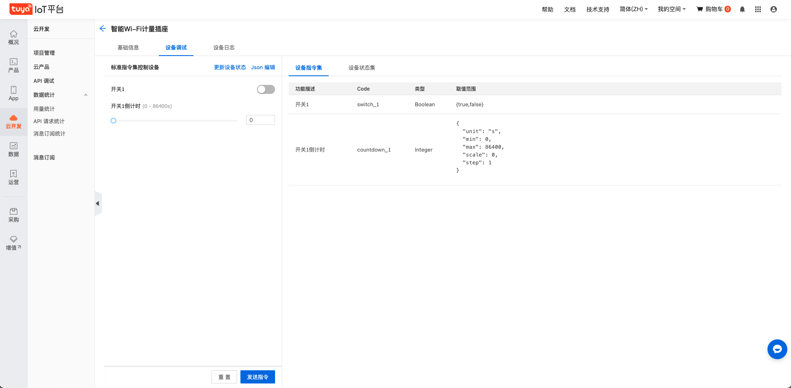

# edgex-device-tuya-go

[中文版](./README_zh.md) | [English](./README.md)

## 概述

连接涂鸦设备的edgex南向驱动

## 用法

### 1. 前提条件

**请事先在[涂鸦IoT平台云开发](https://iot.tuya.com/cloud/)中创建项目并确保项目中至少关联一个设备**

### 2. 运行edgex

下载最新的edgex

```
git clone https://github.com/edgexfoundry/edgex-compose.git
```

进入刚刚克隆到本地的`edgex-compose`目录

- 以**no-sec**模式运行

```
make pull no-secty
make run no-secty
```

- 以**sec**模式运行

```
make pull
make run
make get-token
```

*可以使用`make down`命令停止所有的容器*

有关docker-compose启动的详细信息请看 ：https://github.com/edgexfoundry/edgex-compose/blob/master/README.md

有关sec模式下token生成的详细信息请看：https://github.com/edgexfoundry/edgex-go/blob/master/SECURITY.md

### 3. 运行device-tuya-go

1. 请确保edgex已经成功运行

2. 设置环境变量

   如果运行在**sec**模式则设置为**true**

   ```
   EDGEX_SECURITY_SECRET_STORE=false
   ```

3. 从github获取最新的驱动代码

   ```
   git clone https://github.com/Tuya-Community/edgex-device-tuya-go.git
   ```

4. 驱动运行前修改配置文件

   必须修改的点有:

   - 将`Service.Host`修改为运行该驱动主机的**确切的IP地址**，**不能**是localhost，127.0.0.1，0.0.0.0之类的

   - 修改`[TuyaConnectorInfo]`下的所有内容，这些数据为第一步涂鸦IoT云平台中创建的项目相关信息，其中Region的填写规则如下：

     | 区域   | Region值 |
     | ------ | -------- |
     | 中国区 | CN       |
     | 美国区 | US       |
     | 欧洲区 | EU       |
     | 印度区 | IN       |
     
   - 如果在**sec**模式下运行edgex则需要修改`[SecretStore]`中`TokenFile`的文件地址

5. 运行驱动

   进入到项目的cmd目录中，运行

   ```
   go run main.go --cp=consul.http://localhost:8500 --registry
   ```

   或者，如果你使用的是linux系统还可以通过docker的方式启动该驱动，该启动方式对mac无效（由于docker在mac上不支持host网络模式）

   - 获取docker镜像

     进入项目根目录

     ```
     make docker_device_tuya_go
     ```

   - 运行docker

     **注意挂载时的目录设置为你自己的目录，如果是sec模式则设置EDGEX_SECURITY_SECRET_STORE="true"**

     ```
     docker run --name edgex-device-tuya -v /your/local/path/device-tuya-go/cmd/res:/res --network=host -e EDGEX_SECURITY_SECRET_STORE="false" -d edgexfoundry/device-tuya:0.0.0-dev
     ```

6. 运行成功后

   运行成功后设备服务将被自动注册进edgex的core-metadata中名字为`device-tuya`，通过以下命令可以查看

   ```
   curl http://localhost:59881/api/v2/deviceservice/name/device-tuya
   ```

### 4. 添加设备

我们将第一步中添加进iot项目的设备添加到edgex的core-metadata中

1. 添加设备配置文件(profile文件)

   在项目的`cmd/res/`目录中准备了一份demo文件，示例文件是一个插座，可以按照这个文件修改成对应设备的配置文件，demo配置文件如下：

   ```yaml
   name: "Test.Device.TUYA.Profile"	# 这一项为profile文件的名称，多个profile的名称不可相同
   manufacturer: "Tuya"	# 制造厂商，可以不改
   model: "socket"	# 设备模型
   labels:
     - "test"	# 标签，随意填写
   description: "Test device profile"	# 设备描述
   deviceResources:	# 这里定义的是设备的功能点
     -
       name: switch_1	# 名称随意填写，推荐和下面Code值一样
       isHidden: true
       description: "switch_1"
       attributes:
         { Code: "switch_1" }	# 这个code对应设备指令，可在涂鸦IOT平台查看
       properties:
         valueType: "Bool"
         readWrite: "RW"
         defaultValue: "false"
     -
       name: countdown_1
       isHidden: true
       description: "countdown for switch_1"
       attributes:
         { Code: "countdown_1" }
       properties:
         valueType: "Uint32"
         readWrite: "RW"
         defaultValue: "1"
         minimum: "0"
         maximum: "86400"
   
   deviceCommands:	# 这里定义的是设备命令
     -
       name: switch_1	# 命令名称 推荐和resource名称一致
       readWrite: "RW"
       isHidden: false
       resourceOperations:
         - { deviceResource: "switch_1" }	# 这个命令对应的资源
     -
       name: countdown_1
       readWrite: "RW"
       isHidden: false
       resourceOperations:
         - { deviceResource: "countdown_1" }
   
   ```

   云平台对应参考页面

   

   准备好设备配置文件后，通过下面命令将设备配置文件注册进edgex的core-metadata服务中，注意修改配置文件的路径

   ```
   curl http://localhost:59881/api/v2/deviceprofile/uploadfile -X POST -F "file=@<填写具体的profile文件路径>"
   ```

   如果上述命令没有报异常，那就说明设备配置文件已经被成功添加了，可以通过下面命令查看刚刚添加的配置文件，注意将`Test.Device.TUYA.Profile`改为你配置文件中的name项的值。

   ```
   curl http://localhost:59881/api/v2/deviceprofile/name/Test.Device.TUYA.Profile
   ```

2. 添加设备

   执行下方命令添加设备，注意其中`DeviceId`一项，改为第一步云平台中添加的设备id，`serviceName`为`device-tuya`，`profileName`为上一步添加的profile name，`name`为该设备的名称（自定义，例子中为tuya-test-device）。

   ```
   curl http://localhost:59881/api/v2/device -X POST -H "Content-Type: application/json" -d \
   '[
       {
           "requestId":"",
           "apiVersion":"v2",
           "device":{
               "name":"tuya-test-device",
               "description":"tuya device is created for test purpose",
               "adminState":"UNLOCKED",
               "operatingState":"UP",
               "labels":[
                   "TUYA",
                   "test"
               ],
               "serviceName":"device-tuya",
               "profileName":"Test.Device.TUYA.Profile",
               "protocols":{
                   "tuya":{
                       "DeviceId":"06870016bcddc237998d"
                   }
               }
           }
       }
   ]'
   
   ```

### 5. 发送命令

发送命令的api为`http://localhost:59882/api/v2/device/name/<device_name>/<command_name>`

以demo为例，device_name="tuya-test-device"，command_name="switch_1"

1. 发送GET命令

   ```
   curl http://localhost:59882/api/v2/device/name/tuya-test-device/switch_1
   ```

2. 发送SET命令

   SET命令需通过PUT方法发送，携带的数据类型为json，key为命令名称，value为要设置的值（key,value均为string类型），比如下面这个demo

   ```
   curl http://localhost:59882/api/v2/device/name/tuya-test-device/switch_1 -X PUT \
   	-H "Content-Type: application/json" -d \
   	'{
       "switch_1": "true"
      }'
   ```


## 社区

- 交流: https://edgexfoundry.slack.com
- 邮件列表: https://lists.edgexfoundry.org/mailman/listinfo
- 涂鸦开发者: https://developer.tuya.com/cn/

## 证书

[MIT](LICENSE)